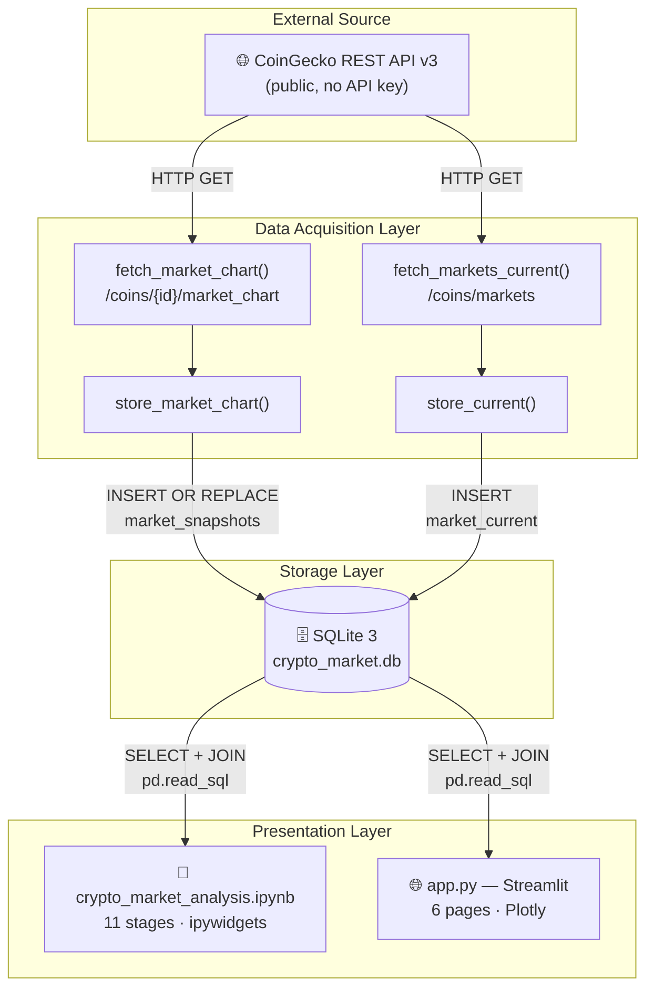
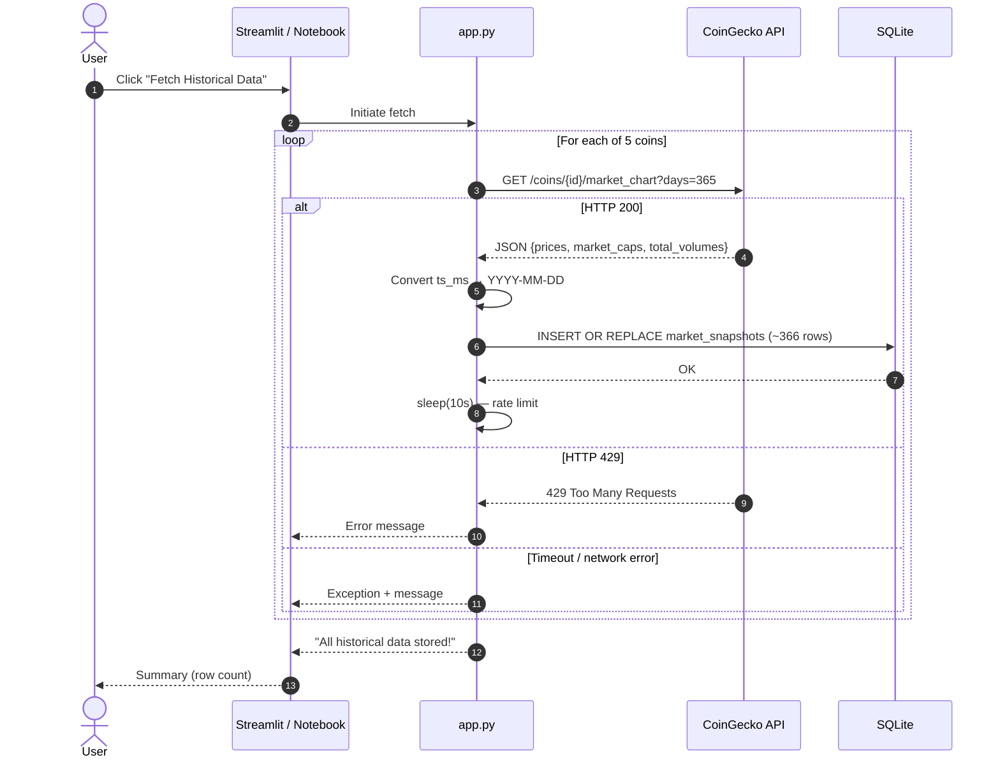
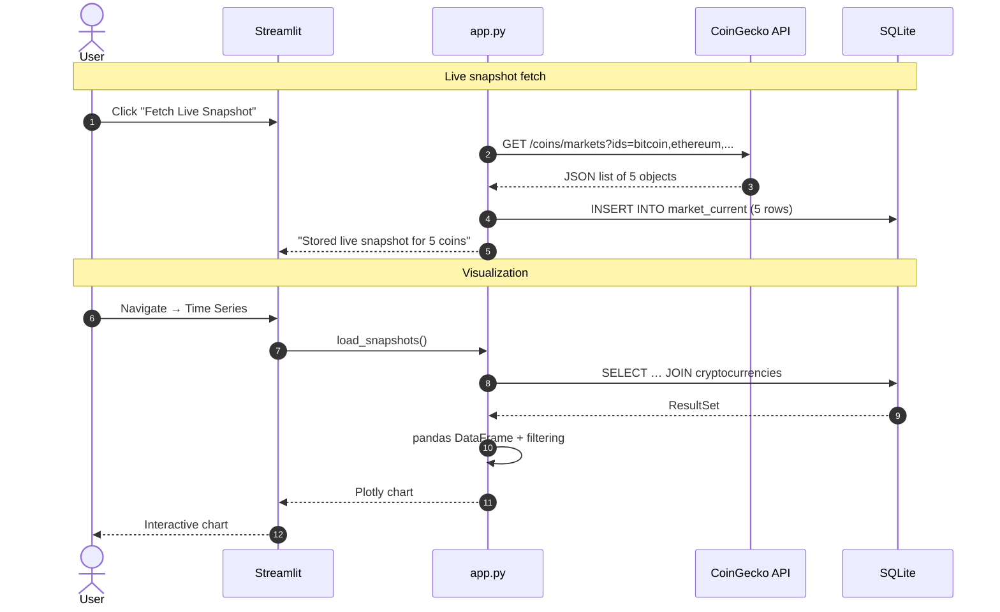
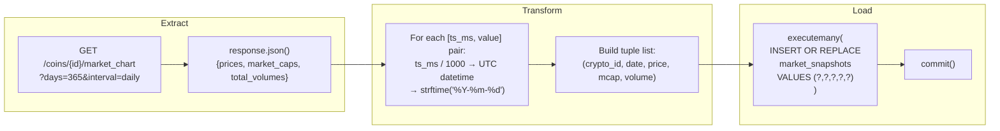
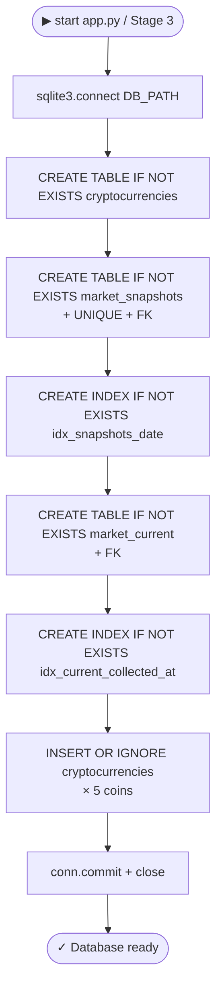
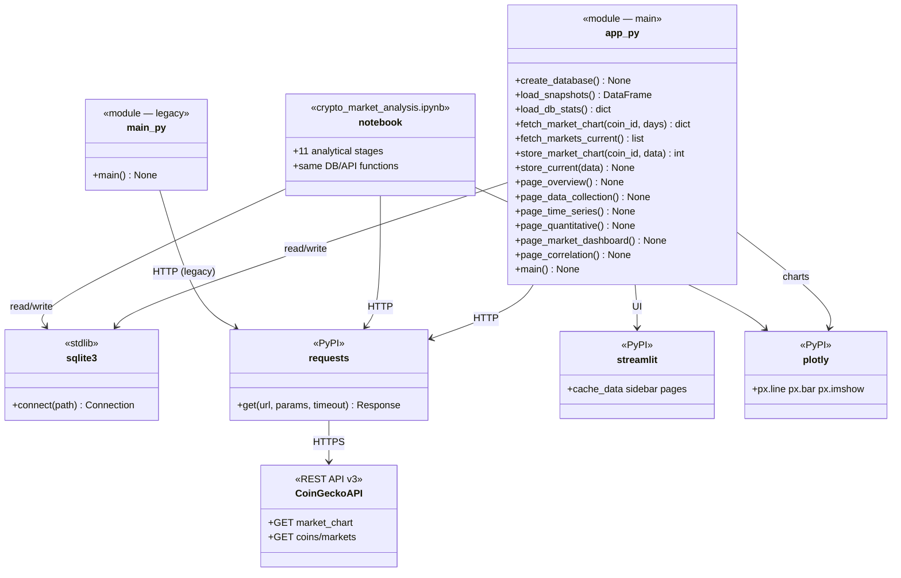
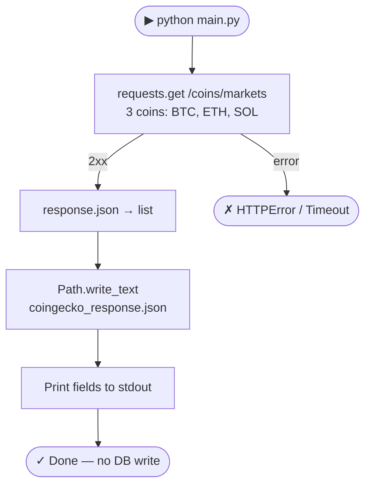

# Diagrams

> All diagrams in [Mermaid](https://mermaid.js.org/) format — render natively on GitHub, GitLab, and Mermaid-capable editors.

Architecture details: [`architecture.md`](architecture.md) · DB schema: [`data-model.md`](data-model.md)

---

## 1. System Architecture (3 Layers)



---

## 2. ERD — Implemented SQLite Schema

```mermaid
erDiagram
    cryptocurrencies {
        TEXT id PK "e.g. bitcoin"
        TEXT symbol NOT_NULL "e.g. BTC"
        TEXT name NOT_NULL "e.g. Bitcoin"
    }

    market_snapshots {
        INTEGER record_id PK "AUTOINCREMENT"
        TEXT crypto_id FK "→ cryptocurrencies.id"
        DATE snapshot_date NOT_NULL "YYYY-MM-DD"
        REAL price_usd "closing price USD"
        REAL market_cap "market cap USD"
        REAL total_volume "24h volume USD"
    }

    market_current {
        INTEGER record_id PK "AUTOINCREMENT"
        TEXT crypto_id FK "→ cryptocurrencies.id"
        DATETIME collected_at NOT_NULL "UTC"
        REAL price_usd
        REAL market_cap
        REAL total_volume
        REAL high_24h
        REAL low_24h
        REAL price_change_24h
        REAL price_change_percentage_24h
        REAL price_change_percentage_7d
        INTEGER market_cap_rank
        REAL circulating_supply
        REAL total_supply
        REAL max_supply
        REAL ath
        REAL ath_change_percentage
    }

    cryptocurrencies ||--o{ market_snapshots : "has daily snapshots"
    cryptocurrencies ||--o{ market_current : "has live snapshots"
```

---

## 3. Sequence Diagram — Historical Data Fetch



---

## 4. Sequence Diagram — Live Fetch + Visualization



---

## 5. Flow Diagram — Historical ETL



---

## 6. Flow Diagram — `create_database()` Logic



---

## 7. Component Diagram — Modules and Dependencies



---

## 8. Flow Diagram — Legacy `main.py`

> Legacy module — replaced by `app.py`. Kept as reference for the early project stage.



---

*Documentation index: [`.docs/README.md`](README.md)*
