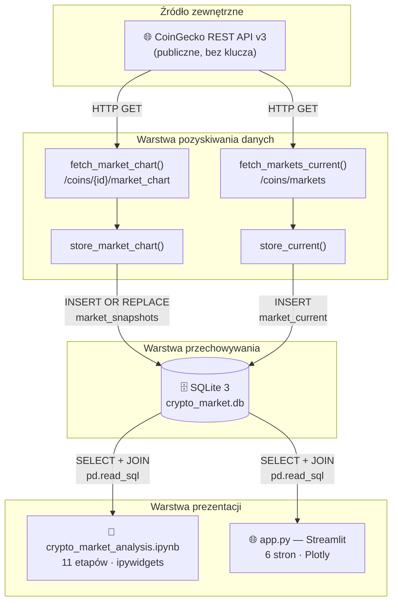
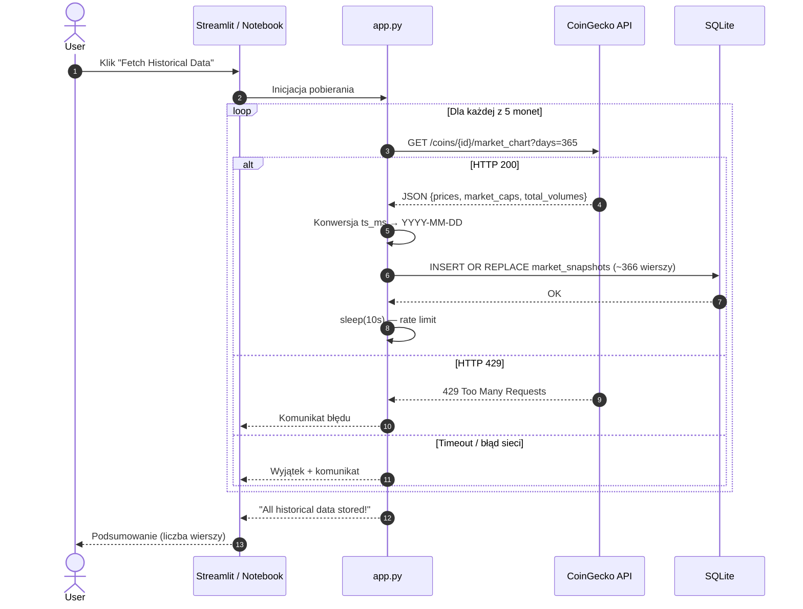
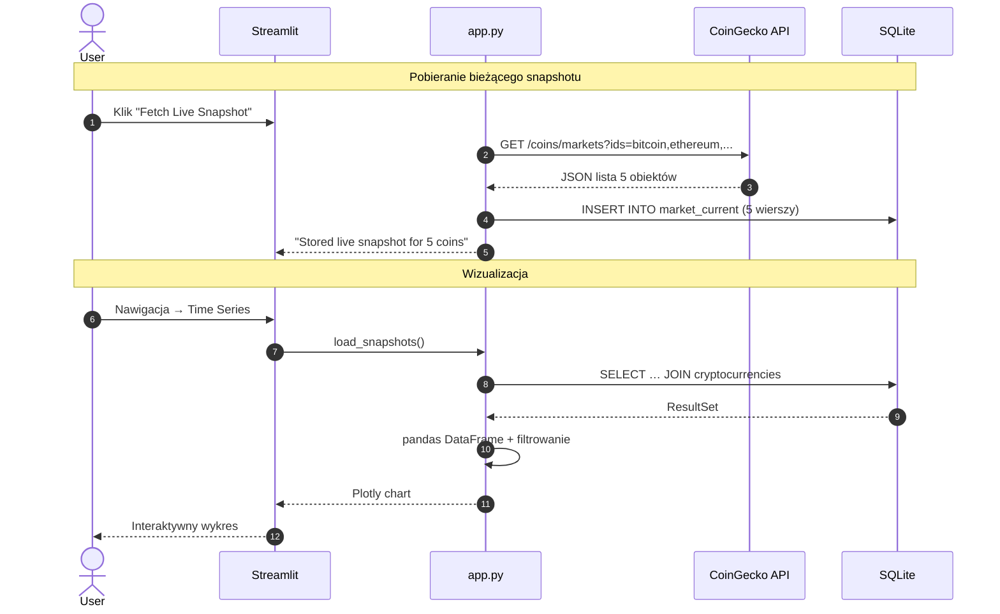
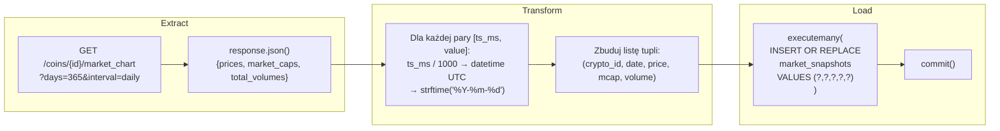
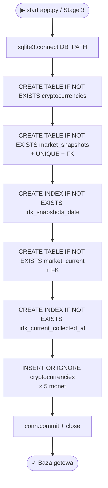
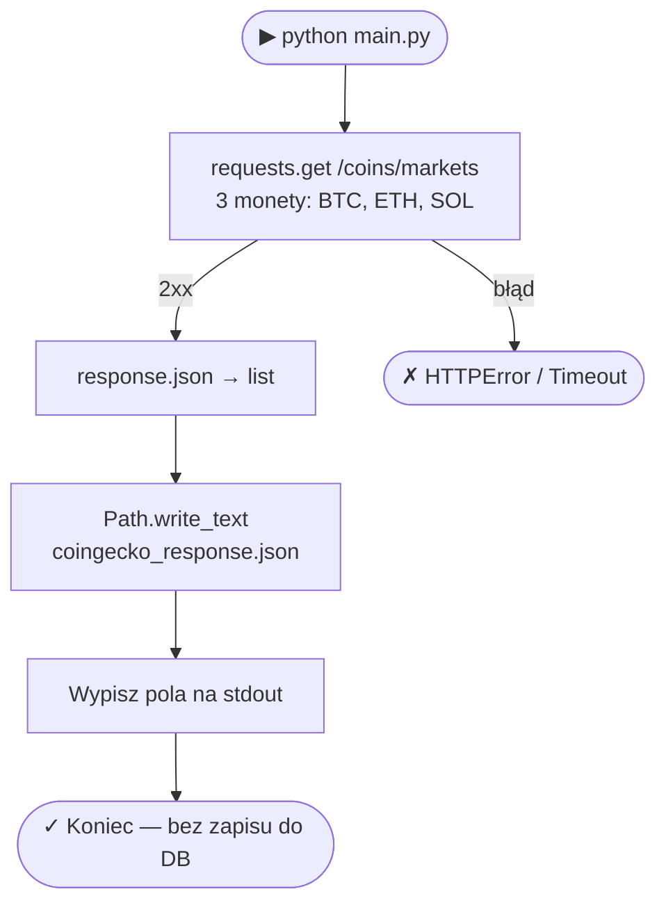

# Diagramy

> Wszystkie diagramy w formacie [Mermaid](https://mermaid.js.org/) — renderują się na GitHub, GitLab i w edytorach z obsługą Mermaid.

Pełny opis architektury: [`architecture.md`](architecture.md) · Schemat DB: [`data-model.md`](data-model.md)

---

## 1. Architektura systemu (3 warstwy)



---

## 2. Diagram ERD — zaimplementowany schemat SQLite

```mermaid
erDiagram
    cryptocurrencies {
        TEXT id PK "np. bitcoin"
        TEXT symbol NOT_NULL "np. BTC"
        TEXT name NOT_NULL "np. Bitcoin"
    }

    market_snapshots {
        INTEGER record_id PK "AUTOINCREMENT"
        TEXT crypto_id FK "→ cryptocurrencies.id"
        DATE snapshot_date NOT_NULL "RRRR-MM-DD"
        REAL price_usd "cena zamknięcia USD"
        REAL market_cap "kapitalizacja USD"
        REAL total_volume "wolumen 24h USD"
    }

    market_current {
        INTEGER record_id PK "AUTOINCREMENT"
        TEXT crypto_id FK "→ cryptocurrencies.id"
        DATETIME collected_at NOT_NULL "UTC"
        REAL price_usd
        REAL market_cap
        REAL total_volume
        REAL high_24h
        REAL low_24h
        REAL price_change_24h
        REAL price_change_percentage_24h
        REAL price_change_percentage_7d
        INTEGER market_cap_rank
        REAL circulating_supply
        REAL total_supply
        REAL max_supply
        REAL ath
        REAL ath_change_percentage
    }

    cryptocurrencies ||--o{ market_snapshots : "ma snapshoty dzienne"
    cryptocurrencies ||--o{ market_current : "ma snapshoty live"
```

---

## 3. Diagram sekwencji — pobieranie danych historycznych



---

## 4. Diagram sekwencji — pobieranie live + wizualizacja



---

## 5. Diagram przepływu — ETL historyczny



---

## 6. Diagram przepływu — logika `create_database()`



---

## 7. Diagram komponentów — moduły i zależności


---

## 8. Diagram przepływu — legacy `main.py`

> Moduł legacy — zastąpiony przez `app.py`. Zachowany jako referencja początkowego etapu.



---

*Indeks dokumentacji: [`.docs/README.md`](README.md)*
