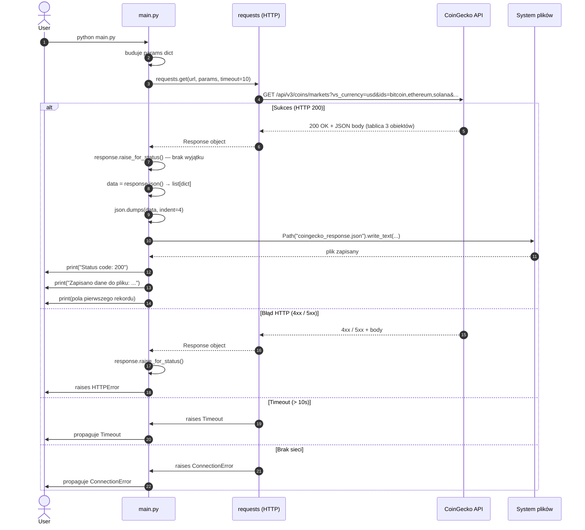
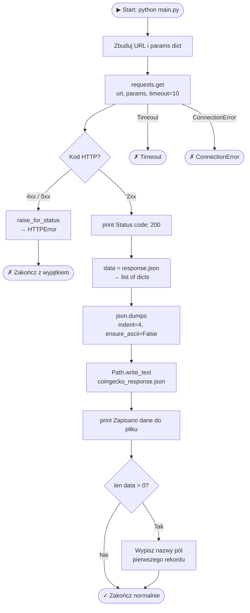
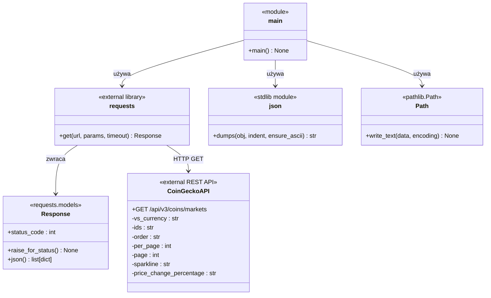
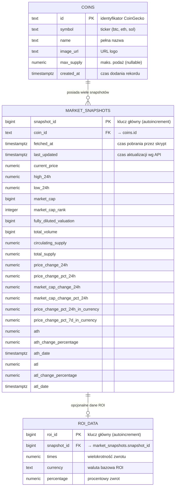
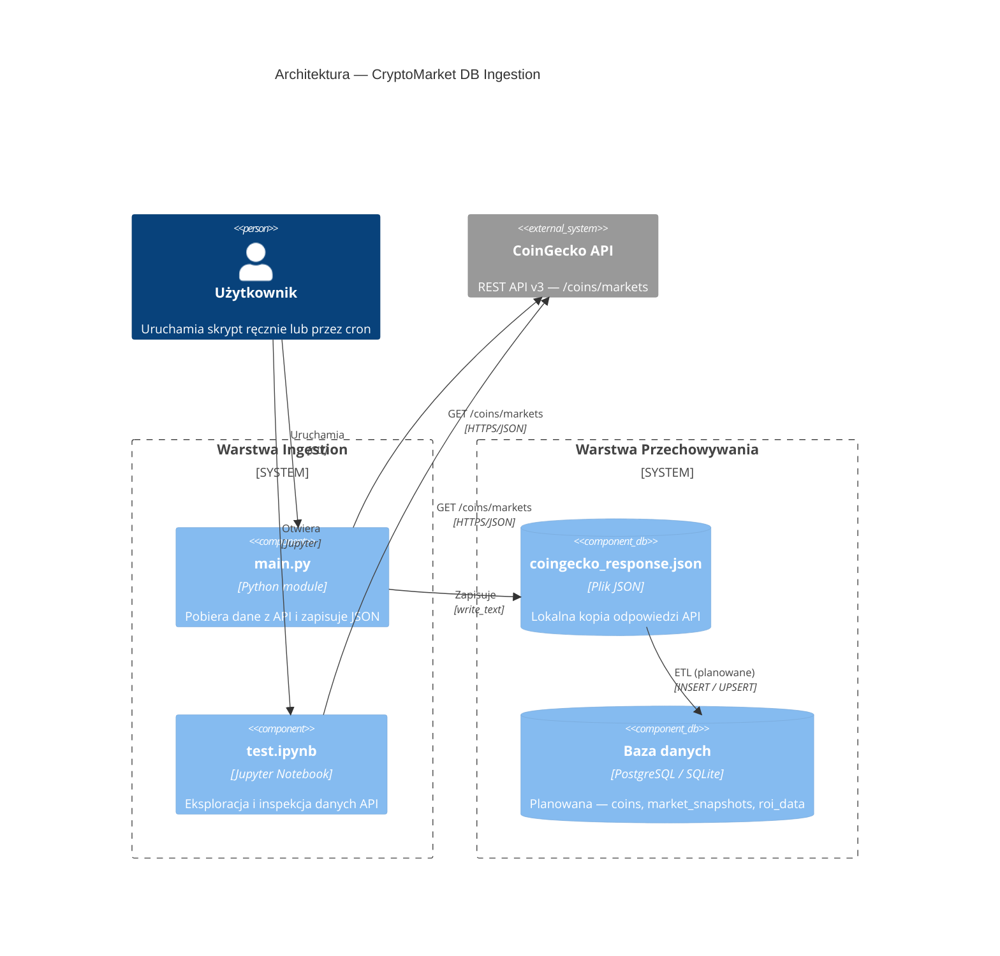
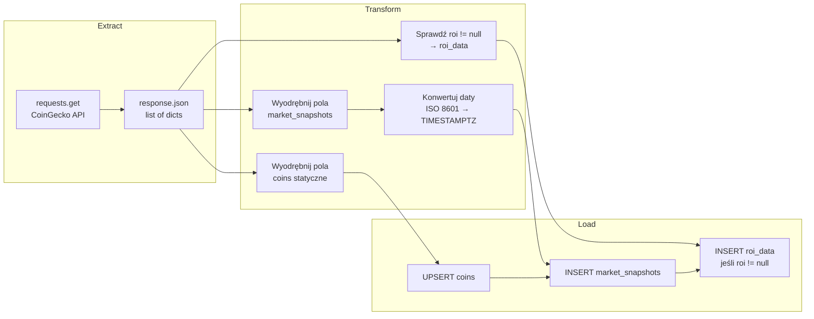

# Diagramy

Wszystkie diagramy zapisane w formacie [Mermaid](https://mermaid.js.org/) — renderują się natywnie na GitHub, GitLab i w edytorach obsługujących Mermaid.

---

## 1. Diagram sekwencji — wywołanie `main()`

Przedstawia pełny przepływ wykonania funkcji `main()`, od startu do zakończenia.

---

## 2. Diagram przepływu — logika funkcji `main()`

---

## 3. Diagram klas / modułów

> Projekt nie definiuje klas OOP — diagram przedstawia **moduły, funkcje i zewnętrzne zależności**.

---

## 4. Diagram ERD — planowany schemat bazy danych

---

## 5. Diagram komponentów — architektura systemu

---

## 6. Diagram aktywności — planowany ETL

Przyszły przepływ ETL (Extract → Transform → Load) do bazy danych.

---

*Opis architektury — zob. [`architecture.md`](architecture.md).*  
*Model danych — zob. [`data-model.md`](data-model.md).*
