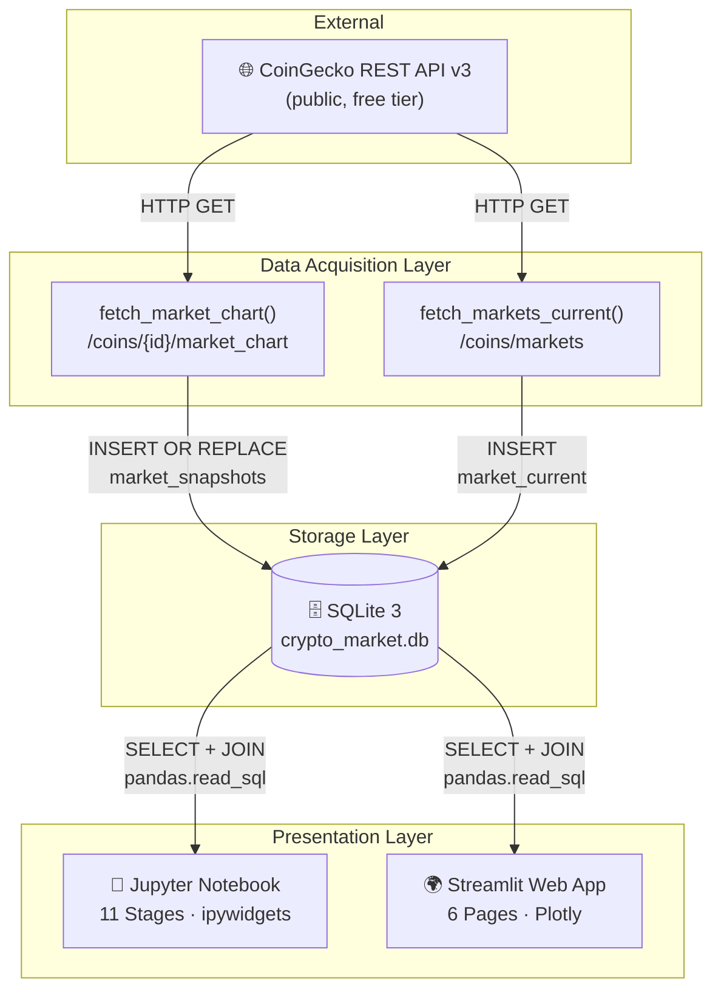
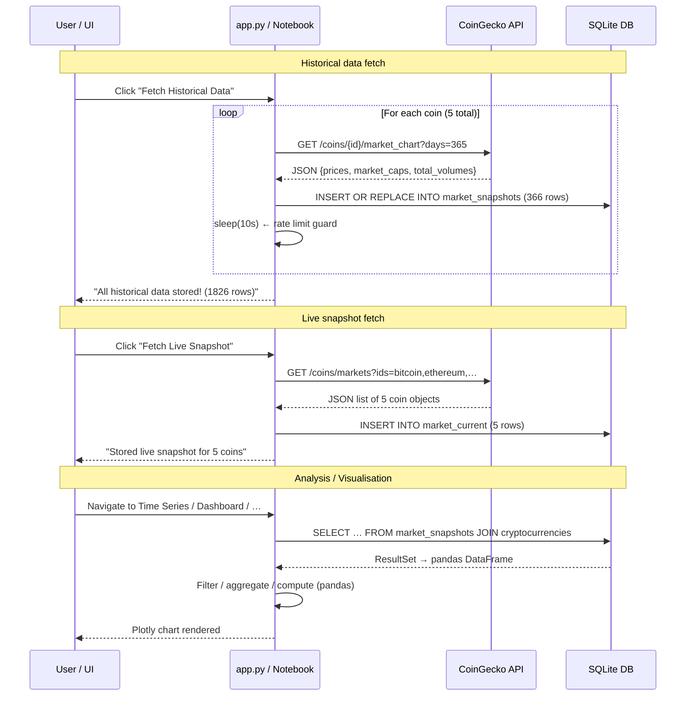

# Technical Documentation — Cryptocurrency Market Analysis System

> **Advanced Databases – Final Project**  
> Automatyka i Robotyka II Stopnia · Informatyka w Sterowaniu i Zarządzaniu  
> **Team:** Michał Dusza · Szymon Bugajski · Mateusz Basiura

### Related documentation

| Document | Language | Purpose |
|----------|----------|---------|
| [`SPRAWOZDANIE.md`](SPRAWOZDANIE.md) | PL | Academic report — full project description for evaluation |
| [`README.md`](README.md) | PL/EN | Quick start, repo structure, documentation index |
| [`.docs/`](.docs/) | PL | Technical docs split by topic (architecture, data model, API, diagrams) |
| [`docs/index.html`](docs/index.html) | PL | Static HTML documentation portal |

---

## Table of Contents

1. [System Architecture](#1-system-architecture)
2. [Database Design](#2-database-design)
   - 2.1 [Entity-Relationship Diagram](#21-entity-relationship-diagram)
   - 2.2 [Table Definitions (DDL)](#22-table-definitions-ddl)
   - 2.3 [Column Reference](#23-column-reference)
   - 2.4 [Constraints & Data Integrity](#24-constraints--data-integrity)
   - 2.5 [Indexes](#25-indexes)
   - 2.6 [Normalisation Analysis](#26-normalisation-analysis)
3. [Data Layer – SQL Queries](#3-data-layer--sql-queries)
   - 3.1 [Write Queries (DML)](#31-write-queries-dml)
   - 3.2 [Read Queries (SELECT)](#32-read-queries-select)
4. [API Integration](#4-api-integration)
5. [Data Flow](#5-data-flow)
6. [Module Reference](#6-module-reference)
   - 6.1 [app.py – Streamlit Application](#61-apppy--streamlit-application)
   - 6.2 [Jupyter Notebook Stages](#62-jupyter-notebook-stages)
7. [Configuration Reference](#7-configuration-reference)
8. [Dependencies](#8-dependencies)

---

## 1. System Architecture

The system consists of three logical tiers: **data acquisition**, **persistent storage**, and **presentation**.



**Key design decisions:**
- **SQLite** — single-file, zero-configuration database; ideal for local analytics projects.
- **INSERT OR REPLACE** on `(crypto_id, snapshot_date)` — idempotent writes; re-running the fetch never duplicates historical rows.
- **`uv`** — all Python execution goes through `uv run …`, which resolves the `.venv` automatically without manual shell activation.
- **Separation of concerns** — data collection is independent from visualisation; the notebook and app both read from the same DB file.

---

## 2. Database Design

### 2.1 Entity-Relationship Diagram

```mermaid
erDiagram
    cryptocurrencies {
        TEXT id PK "e.g. bitcoin"
        TEXT symbol NOT_NULL "e.g. BTC"
        TEXT name   NOT_NULL "e.g. Bitcoin"
    }

    market_snapshots {
        INTEGER record_id PK "AUTOINCREMENT"
        TEXT    crypto_id FK "→ cryptocurrencies.id"
        DATE    snapshot_date NOT_NULL "YYYY-MM-DD"
        REAL    price_usd     "closing price"
        REAL    market_cap    "total market cap"
        REAL    total_volume  "24h traded volume"
    }

    market_current {
        INTEGER  record_id  PK "AUTOINCREMENT"
        TEXT     crypto_id  FK "→ cryptocurrencies.id"
        DATETIME collected_at NOT_NULL "UTC timestamp"
        REAL     price_usd
        REAL     market_cap
        REAL     total_volume
        REAL     high_24h
        REAL     low_24h
        REAL     price_change_24h
        REAL     price_change_percentage_24h
        REAL     price_change_percentage_7d
        INTEGER  market_cap_rank
        REAL     circulating_supply
        REAL     total_supply
        REAL     max_supply
        REAL     ath
        REAL     ath_change_percentage
    }

    cryptocurrencies ||--o{ market_snapshots : "tracked via"
    cryptocurrencies ||--o{ market_current   : "tracked via"
```

### 2.2 Table Definitions (DDL)

```sql
-- Master lookup table: one row per tracked cryptocurrency
CREATE TABLE IF NOT EXISTS cryptocurrencies (
    id     TEXT PRIMARY KEY,   -- CoinGecko canonical ID, e.g. "bitcoin"
    symbol TEXT NOT NULL,      -- ticker symbol, e.g. "BTC"
    name   TEXT NOT NULL       -- human-readable name, e.g. "Bitcoin"
);

-- Historical daily OHLCV-like snapshots from /coins/{id}/market_chart
CREATE TABLE IF NOT EXISTS market_snapshots (
    record_id     INTEGER PRIMARY KEY AUTOINCREMENT,
    crypto_id     TEXT    NOT NULL,
    snapshot_date DATE    NOT NULL,
    price_usd     REAL,
    market_cap    REAL,
    total_volume  REAL,
    UNIQUE (crypto_id, snapshot_date),
    FOREIGN KEY (crypto_id) REFERENCES cryptocurrencies(id)
);

CREATE INDEX IF NOT EXISTS idx_snapshots_date
    ON market_snapshots(snapshot_date);

-- Live point-in-time snapshots from /coins/markets (one row per fetch per coin)
CREATE TABLE IF NOT EXISTS market_current (
    record_id                   INTEGER  PRIMARY KEY AUTOINCREMENT,
    crypto_id                   TEXT     NOT NULL,
    collected_at                DATETIME NOT NULL,
    price_usd                   REAL,
    market_cap                  REAL,
    total_volume                REAL,
    high_24h                    REAL,
    low_24h                     REAL,
    price_change_24h            REAL,
    price_change_percentage_24h REAL,
    price_change_percentage_7d  REAL,
    market_cap_rank             INTEGER,
    circulating_supply          REAL,
    total_supply                REAL,
    max_supply                  REAL,
    ath                         REAL,
    ath_change_percentage       REAL,
    FOREIGN KEY (crypto_id) REFERENCES cryptocurrencies(id)
);

CREATE INDEX IF NOT EXISTS idx_current_collected_at
    ON market_current(collected_at);
```

### 2.3 Column Reference

#### `cryptocurrencies`

| Column   | Type | Nullable | Description |
|----------|------|----------|-------------|
| `id`     | TEXT | NO (PK)  | CoinGecko API identifier (lowercase, e.g. `bitcoin`) |
| `symbol` | TEXT | NO       | Ticker symbol used on exchanges (e.g. `BTC`) |
| `name`   | TEXT | NO       | Full display name (e.g. `Bitcoin`) |

#### `market_snapshots`

| Column          | Type    | Nullable | Description |
|-----------------|---------|----------|-------------|
| `record_id`     | INTEGER | NO (PK)  | Surrogate key, auto-incremented |
| `crypto_id`     | TEXT    | NO (FK)  | References `cryptocurrencies.id` |
| `snapshot_date` | DATE    | NO       | Date of the candle (`YYYY-MM-DD`), UTC midnight from API |
| `price_usd`     | REAL    | YES      | Closing price in USD |
| `market_cap`    | REAL    | YES      | Total market capitalisation in USD |
| `total_volume`  | REAL    | YES      | 24-hour trading volume in USD |

> **Source:** `GET /coins/{id}/market_chart?vs_currency=usd&days=365&interval=daily`  
> The API returns millisecond Unix timestamps; the application converts them to `YYYY-MM-DD` strings via `datetime.utcfromtimestamp(ts / 1000).strftime("%Y-%m-%d")`.

#### `market_current`

| Column                        | Type     | Nullable | Description |
|-------------------------------|----------|----------|-------------|
| `record_id`                   | INTEGER  | NO (PK)  | Surrogate key, auto-incremented |
| `crypto_id`                   | TEXT     | NO (FK)  | References `cryptocurrencies.id` |
| `collected_at`                | DATETIME | NO       | UTC timestamp of data collection (`YYYY-MM-DD HH:MM:SS`) |
| `price_usd`                   | REAL     | YES      | Current price in USD |
| `market_cap`                  | REAL     | YES      | Total market cap in USD |
| `total_volume`                | REAL     | YES      | 24-hour trading volume in USD |
| `high_24h`                    | REAL     | YES      | 24-hour high price |
| `low_24h`                     | REAL     | YES      | 24-hour low price |
| `price_change_24h`            | REAL     | YES      | Absolute price change over 24h (USD) |
| `price_change_percentage_24h` | REAL     | YES      | Percentage price change over 24h |
| `price_change_percentage_7d`  | REAL     | YES      | Percentage price change over 7 days |
| `market_cap_rank`             | INTEGER  | YES      | Global market cap rank |
| `circulating_supply`          | REAL     | YES      | Number of coins in circulation |
| `total_supply`                | REAL     | YES      | Total coins ever created |
| `max_supply`                  | REAL     | YES      | Maximum possible supply (NULL if infinite) |
| `ath`                         | REAL     | YES      | All-time high price in USD |
| `ath_change_percentage`       | REAL     | YES      | Percentage distance from ATH (negative = below ATH) |

> **Source:** `GET /coins/markets?vs_currency=usd&ids=…&price_change_percentage=24h,7d`

### 2.4 Constraints & Data Integrity

| Constraint | Table | Definition | Purpose |
|------------|-------|------------|---------|
| **PRIMARY KEY** | all | `record_id` (surrogate) or `id` | Uniquely identifies each row |
| **FOREIGN KEY** | `market_snapshots` | `crypto_id → cryptocurrencies.id` | Prevents orphaned snapshot rows |
| **FOREIGN KEY** | `market_current` | `crypto_id → cryptocurrencies.id` | Prevents orphaned live records |
| **UNIQUE** | `market_snapshots` | `(crypto_id, snapshot_date)` | One price record per coin per day; enables idempotent `INSERT OR REPLACE` |
| **NOT NULL** | `market_snapshots` | `crypto_id`, `snapshot_date` | Core identifiers must always be present |
| **NOT NULL** | `market_current` | `crypto_id`, `collected_at` | Core identifiers must always be present |

> SQLite enforces foreign keys only when `PRAGMA foreign_keys = ON` is set per connection. In this project the application logic guarantees referential integrity by always inserting into `cryptocurrencies` first (using `INSERT OR IGNORE`).

### 2.5 Indexes

| Index Name                  | Table              | Column(s)         | Purpose |
|-----------------------------|--------------------|-------------------|---------|
| `PRIMARY KEY`               | all tables         | `id` / `record_id`| Row lookup by PK |
| `UNIQUE(crypto_id, snapshot_date)` | `market_snapshots` | composite | Deduplication; also acts as a covering index for `WHERE crypto_id = ? AND snapshot_date BETWEEN ? AND ?` |
| `idx_snapshots_date`        | `market_snapshots` | `snapshot_date`   | Fast range scans in time-series queries |
| `idx_current_collected_at`  | `market_current`   | `collected_at`    | Fast range scans when reading live snapshot history |

**Query plan example** — time series for one coin over a date range:

```sql
EXPLAIN QUERY PLAN
SELECT snapshot_date, price_usd
FROM market_snapshots
WHERE crypto_id = 'bitcoin'
  AND snapshot_date BETWEEN '2025-01-01' AND '2025-12-31'
ORDER BY snapshot_date;
-- → SEARCH market_snapshots USING INDEX sqlite_autoindex_market_snapshots_1
--   (crypto_id=? AND snapshot_date>? AND snapshot_date<?)
```

The composite UNIQUE constraint effectively serves as a two-column B-tree index, making both the equality filter on `crypto_id` and the range filter on `snapshot_date` index-assisted.

### 2.6 Normalisation Analysis

The schema satisfies **Third Normal Form (3NF)**:

**1NF** — All columns are atomic (single-valued), there are no repeating groups.

**2NF** — `market_snapshots` and `market_current` both use a surrogate integer PK, so every non-key attribute depends on the whole key. The `cryptocurrencies` table has a natural TEXT PK; `symbol` and `name` fully depend on `id`.

**3NF** — There are no transitive dependencies. Coin metadata (`symbol`, `name`) lives exclusively in `cryptocurrencies` and is never duplicated in the fact tables — only the FK `crypto_id` is stored. All attributes in the fact tables depend directly on the primary key and nothing else.

| Table | 1NF | 2NF | 3NF | Notes |
|-------|-----|-----|-----|-------|
| `cryptocurrencies` | ✅ | ✅ | ✅ | Simple lookup table |
| `market_snapshots` | ✅ | ✅ | ✅ | Fact table; no derived columns stored |
| `market_current` | ✅ | ✅ | ✅ | Wide fact table; all fields are raw API values |

> Note: `price_change_24h` and `price_change_percentage_24h` are technically derivable from two consecutive rows of `market_snapshots`, but they are stored in `market_current` because they come directly from the API and represent point-in-time values (computed at API-server time), not locally computed differences.

---

## 3. Data Layer – SQL Queries

### 3.1 Write Queries (DML)

#### Populate master coin list

```sql
INSERT OR IGNORE INTO cryptocurrencies (id, symbol, name)
VALUES (?, ?, ?);
-- Parameters: ('bitcoin', 'BTC', 'Bitcoin'), …
-- INSERT OR IGNORE: safe to run multiple times; existing rows are untouched.
```

#### Store historical snapshots

```sql
INSERT OR REPLACE INTO market_snapshots
    (crypto_id, snapshot_date, price_usd, market_cap, total_volume)
VALUES (?, ?, ?, ?, ?);
-- INSERT OR REPLACE triggers when UNIQUE(crypto_id, snapshot_date) conflicts.
-- Effect: deletes the conflicting row and inserts the new one.
-- This makes daily re-fetches idempotent — no duplicate rows accumulate.
```

#### Store live snapshot

```sql
INSERT INTO market_current
    (crypto_id, collected_at, price_usd, market_cap, total_volume,
     high_24h, low_24h, price_change_24h, price_change_percentage_24h,
     price_change_percentage_7d, market_cap_rank, circulating_supply,
     total_supply, max_supply, ath, ath_change_percentage)
VALUES (?, ?, ?, ?, ?, ?, ?, ?, ?, ?, ?, ?, ?, ?, ?, ?);
-- Plain INSERT (no conflict handling): each fetch creates a new time-stamped row,
-- preserving full history of live snapshots.
```

### 3.2 Read Queries (SELECT)

#### Full dataset join (used in all analyses)

```sql
SELECT s.snapshot_date,
       s.price_usd,
       s.market_cap,
       s.total_volume,
       c.name,
       c.symbol
FROM   market_snapshots s
JOIN   cryptocurrencies c ON s.crypto_id = c.id
ORDER  BY s.snapshot_date;
```

#### Per-coin statistics (Data Collection page)

```sql
SELECT c.name,
       c.symbol,
       COUNT(*)                   AS records,
       MIN(s.snapshot_date)       AS from_date,
       MAX(s.snapshot_date)       AS to_date,
       ROUND(MIN(s.price_usd), 2) AS min_price_usd,
       ROUND(MAX(s.price_usd), 2) AS max_price_usd,
       ROUND(AVG(s.price_usd), 2) AS avg_price_usd
FROM   market_snapshots s
JOIN   cryptocurrencies c ON s.crypto_id = c.id
GROUP  BY c.id
ORDER  BY MAX(s.market_cap) DESC;
```

#### Row counts (Overview / Stats)

```sql
SELECT COUNT(*) FROM cryptocurrencies;
SELECT COUNT(*) FROM market_snapshots;
SELECT COUNT(*) FROM market_current;
SELECT MIN(snapshot_date), MAX(snapshot_date) FROM market_snapshots;
```

#### Time-series slice (pandas-level filtering after full load)

The application loads the full dataset into a `pandas.DataFrame` via `pd.read_sql` and then applies filters in memory for interactive responsiveness. For a production system with millions of rows, WHERE clauses would be pushed down to SQL:

```sql
-- Equivalent parameterised query (push-down version)
SELECT s.snapshot_date, s.price_usd, s.market_cap, s.total_volume,
       c.name, c.symbol
FROM   market_snapshots s
JOIN   cryptocurrencies c ON s.crypto_id = c.id
WHERE  c.name IN (?, ?, ?)                  -- selected coins
  AND  s.snapshot_date BETWEEN ? AND ?       -- date range
ORDER  BY c.name, s.snapshot_date;
```

---

## 4. API Integration

### Endpoints used

| Endpoint | Method | Parameters | Returns |
|----------|--------|------------|---------|
| `/coins/{id}/market_chart` | GET | `vs_currency=usd`, `days=365`, `interval=daily` | `{prices, market_caps, total_volumes}` arrays of `[ts_ms, value]` pairs |
| `/coins/markets` | GET | `vs_currency=usd`, `ids=…`, `order=market_cap_desc`, `price_change_percentage=24h,7d` | List of coin objects with current stats |

### Rate limiting

| Tier | Limit | Strategy |
|------|-------|----------|
| Free (no API key) | ~10–30 req / min | `time.sleep(REQUEST_DELAY)` = 10 s between calls |
| 5 coins × historical | 5 requests | ~50 s total |
| 5 coins × live | 1 request (batch) | instant |

### Response parsing (`/market_chart`)

```python
data = response.json()
# data["prices"]        → [[ts_ms, price], …]
# data["market_caps"]   → [[ts_ms, mcap],  …]
# data["total_volumes"] → [[ts_ms, vol],   …]

rows = [
    (
        coin_id,
        datetime.utcfromtimestamp(ts / 1000).strftime("%Y-%m-%d"),  # ms → date
        price,
        market_caps[i][1],
        total_volumes[i][1],
    )
    for i, (ts, price) in enumerate(data["prices"])
]
```

### Error handling

- `requests.Response.raise_for_status()` converts HTTP 4xx/5xx to `requests.HTTPError`.
- HTTP 429 (Too Many Requests): caught in the UI layer; the user is shown an error and can retry after waiting.
- Network timeouts: `timeout=20` seconds per request.

---

## 5. Data Flow



---

## 6. Module Reference

### 6.1 `app.py` – Streamlit Application

#### Database functions

| Function | Signature | Description |
|----------|-----------|-------------|
| `create_database` | `() → None` | Creates all three tables and indexes if they don't exist; also seeds `cryptocurrencies`. Called at app startup. |
| `load_snapshots` | `() → pd.DataFrame` | Loads the full `market_snapshots` JOIN result into a DataFrame. Decorated with `@st.cache_data(ttl=60)` — cached for 60 s. |
| `load_db_stats` | `() → dict` | Returns row counts for all three tables plus the date range from `market_snapshots`. Cached 60 s. |

#### API functions

| Function | Signature | Description |
|----------|-----------|-------------|
| `fetch_market_chart` | `(coin_id: str, days: int = 365) → dict` | Calls `/coins/{coin_id}/market_chart`. Returns raw API JSON. |
| `fetch_markets_current` | `() → list` | Calls `/coins/markets` for all tracked coins. Returns list of coin dicts. |
| `store_market_chart` | `(coin_id: str, data: dict) → int` | Parses API response, converts timestamps, bulk-inserts into `market_snapshots`. Returns rows stored. |
| `store_current` | `(data: list) → None` | Inserts one row per coin into `market_current` with a UTC timestamp. |

#### Helper functions

| Function | Signature | Description |
|----------|-----------|-------------|
| `fmt_pct` | `(x: float) → str` | Formats a float as `▲ 3.14%` or `▼ 1.23%`; returns `"N/A"` for NaN. |
| `build_dashboard_df` | `(df: pd.DataFrame) → pd.DataFrame` | Computes 24h/7d/30d % changes from historical snapshots; returns dashboard-ready DataFrame. |

#### Page functions

| Function | Route Name | Description |
|----------|-----------|-------------|
| `page_overview` | 🏠 Overview | KPI metrics, date range info, navigation table |
| `page_data_collection` | 📥 Data Collection | Historical + live fetch buttons with progress; DB summary table |
| `page_time_series` | 📈 Time Series | Line chart; 6 sidebar filters (coins, date range, metric, MA, log scale) |
| `page_quantitative` | 📊 Quantitative Analysis | Bar/Box/Violin; 6 sidebar filters |
| `page_market_dashboard` | 🗺️ Market Dashboard | KPI cards, summary table, grouped bar, heatmap, treemap |
| `page_correlation` | 🔗 Correlation & Volatility | Correlation matrix, volatility bar, rolling 30-day BTC correlation |

### 6.2 Jupyter Notebook Stages

| Stage | Description | Key operations |
|-------|-------------|----------------|
| 1 | Environment note | Documents `uv sync` setup |
| 2 | Imports & constants | `DB_PATH`, `BASE_URL`, `REQUEST_DELAY=10`, `COINS` list, `METRIC_MAP` |
| 3 | Database initialisation | `create_database()` — all CREATE TABLE / INDEX statements |
| 4 | Coin master data | `populate_cryptocurrencies()` + verification SELECT |
| 5 | API helpers + fetch | `fetch_market_chart`, `store_market_chart`, `fetch_markets_current`, `store_current` |
| 5b | Main fetch loop | Iterates all 5 coins; stores 366 rows each; `time.sleep(10)` between coins |
| 6 | DB verification | Row count checks, date range validation |
| 7 | Load DataFrame | `pd.read_sql` JOIN query; dtype casting for `snapshot_date` |
| 8 | Time Series | `ipywidgets`: SelectMultiple (coins), 2× DatePicker, Dropdown (metric), IntSlider (MA), ToggleButton (log) |
| 9 | Quantitative Analysis | `ipywidgets`: SelectMultiple, Dropdown (metric, period, aggregation, sort, chart type) |
| 10 | Market Dashboard | `build_dashboard_df()`; KPI display; 4 Plotly charts (table, grouped bar, heatmap, treemap) |
| 11 | Correlation & Volatility | `price_pivot.pct_change()`; `returns.corr()`; annualised volatility `std × √365 × 100` |

---

## 7. Configuration Reference

All runtime constants are defined at the top of both `app.py` and the notebook Stage 2 cell:

| Constant | Default | Description |
|----------|---------|-------------|
| `DB_PATH` | `"crypto_market.db"` | Path to the SQLite file (relative to working directory) |
| `BASE_URL` | `"https://api.coingecko.com/api/v3"` | CoinGecko API base URL |
| `REQUEST_DELAY` | `10` (seconds) | Sleep time between consecutive API calls to respect rate limits |
| `COINS` | 5-element list | Tracked cryptocurrencies; each entry has `id`, `symbol`, `name` |

### Tracked Coins

| `id` (API) | `symbol` | `name` |
|------------|----------|--------|
| `bitcoin` | BTC | Bitcoin |
| `ethereum` | ETH | Ethereum |
| `solana` | SOL | Solana |
| `binancecoin` | BNB | BNB |
| `ripple` | XRP | XRP |

### Metric Map

| Label | DataFrame column |
|-------|-----------------|
| Price (USD) | `price_usd` |
| Market Capitalization | `market_cap` |
| Trading Volume (24h) | `total_volume` |

---

## 8. Dependencies

All dependencies are locked in `uv.lock` and declared in `pyproject.toml`:

```toml
[project]
name = "crypto-market-analysis"
version = "0.1.0"
requires-python = ">=3.13"
dependencies = [
    "requests>=2.33",      # HTTP client for CoinGecko API
    "pandas>=2.2",         # DataFrame manipulation, pd.read_sql
    "plotly>=5.22",        # Interactive charts (px.line, px.bar, px.imshow, …)
    "ipywidgets>=8.1",     # Interactive notebook filters
    "ipykernel>=6.29",     # Jupyter kernel registration
    "jupyter>=1.1",        # JupyterLab / classic notebook server
    "nbformat>=5.10",      # Notebook file format support
    "streamlit>=1.35",     # Web application framework
]
```

| Package | Version (locked) | Role |
|---------|-----------------|------|
| Python | 3.13 | Runtime (pinned via `.python-version`) |
| uv | 0.10.9+ | Package and virtual environment manager |
| sqlite3 | stdlib | Database driver (no external dependency) |
| requests | 2.33+ | REST API calls |
| pandas | 2.2+ | Data manipulation, SQL bridge |
| plotly | 6.7+ | All interactive charts |
| ipywidgets | 8.1+ | Notebook interactive controls |
| streamlit | 1.57+ | Web application UI framework |
| altair | 6.1+ | Transitive dep of streamlit |
| pyarrow | 24.0+ | Efficient DataFrame serialisation in Streamlit |

---

*End of Technical Documentation*
